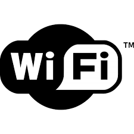

ioBroker esp8266 adapter

=================
Lets control esp8266 over the ethernet.

## Install

Copy and rename iobroker.megad adapter to iobroker.esp8266.

In file
c:\Program Files\ioBroker\node_modules\iobroker.js-controller\conf\sources-dist.json
add module:

  "esp8266": {
    "meta": "https://github.com/gotren/marelitHOME/blob/master/io-package.json",
    "url": https://github.com/gotren/marelitHOME/archive/master.zip
    "icon": "https://raw.githubusercontent.com/gotren/marelitHOME/master/admin/esp8266.png"
  },

In command prompt do:

```cd c:\Program Files\ioBroker\node_modules\iobroker.js-controller\     node iobroker.js update (add, install) esp8266```

### Information

to do...